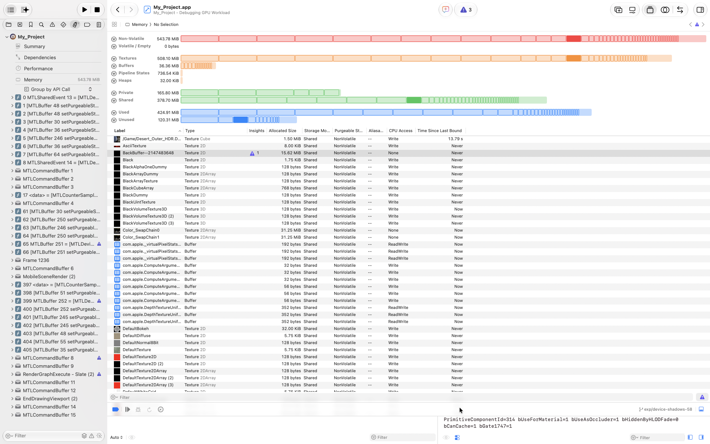
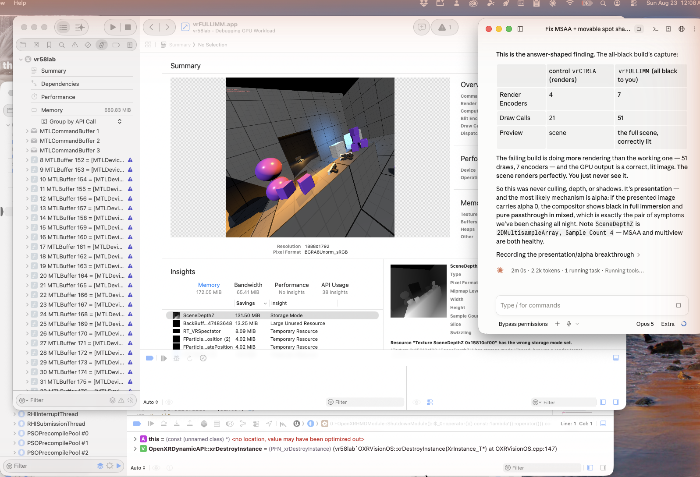

# gputrace

*Works great with an LLM: structured text output an agent can grep and reason over, not a GUI it has to screenshot.*

Offline reader for Xcode `.gputrace` captures — the packages Xcode's Metal GPU debugger
writes to disk. Instead of driving that GUI to answer one specific question ("is this
array texture populated for both eyes?", "what encoder actually wrote this render
target?"), this parses the capture's record format directly, so the answer is a one-line
command instead of a click-through session.

Apple documents none of this format. The layout below was derived byte-by-byte from a
visionOS 26 capture (Xcode 26.6, 2026-08-25) and has since been exercised against UE
5.8.1 Metal captures — treat selector IDs as a starting point to re-derive per Xcode
version, not a stable contract.



This is the GUI table `gputrace.py textures` / `descriptors` replaces — scrollable,
un-filterable from a script, and one capture at a time. The same query is a one-line
command that composes with grep, diffs across captures, or runs unattended in an agent
loop.

## How a `.gputrace` is laid out

A `.gputrace` is a directory. The interesting members:

| member | holds |
|---|---|
| `device-resources-*` | resource creation, `setLabel:` calls, pixel-dump manifests |
| `capture` | the submitted command stream — encoder labels, debug groups |
| `MTLTexture-<id>-<n>-mipmap<m>-slice<s>` | raw pixel dumps, one file per slice |

All three stream files start with the magic `MTSP` and are a flat sequence of
little-endian records:

```
u32  len          total bytes of this record
i32  selector     negative id, stable within a trace (not a global name table)
24B  reserved     observed all-zero
u32  kind         small domain/class enum
char sig[]        NUL-terminated, padded to 4 bytes
args              packed per sig
```

`sig` characters: `C` = u64 receiver, `S` = C string, `u`/`i` = u32, `l`/`w` = u64,
`b` = byte. A `setLabel:` record is `sig='CS'` → `(object pointer, label)`; join those to
the pixel-dump manifest records by pointer and you get a named texture inventory.

## Two silent-failure traps in the pixel dumps

Both of these produce a plausible-looking image that is quietly wrong — no crash, no
exception, just a wrong answer.

1. **The pixel payload is the tail of the file, not a fixed offset.** Compute
   `offset = filesize - height * bytesPerRow`. The header is 8192 or 16384 bytes
   depending on format — probe for it (see `_bpp()` in `gputrace.py`), don't hardcode it.

2. **Depth+stencil dumps are planar, not row-interleaved.** A `depth32float_stencil8`
   dump is a full `h*w*4` float32 depth plane followed by a full `h*w` stencil plane —
   not rows of `bytesPerRow = w*5` bytes each. Reading it as interleaved rows produces a
   coherent-looking depth image whose bottom ~20% is exactly zero, which reads as "the
   depth buffer has a gap" when it's actually the stencil plane being misread as depth
   rows. The tell was a suspiciously round cutoff row (`1433 = 1792 * 4/5`); the check
   that caught it was comparing median vertical gradient between the two layout
   hypotheses — the correct layout is ~100x smoother (0.000101 vs. 0.00972).

`bytesPerRow` itself isn't reliably decodable from the manifest — resolve it from the
dump's own file size instead: try 4 and 5 bytes per pixel and accept whichever makes
`filesize - w*h*bpp` land on a known header size (8192 or 16384). That also tells you
whether it's a color or a depth+stencil dump.

## Quickstart

```bash
python3 gputrace.py capture.gputrace textures                        # labeled texture inventory
python3 gputrace.py capture.gputrace encoders                        # encoder + debug-group tree
python3 gputrace.py capture.gputrace dump ScreenSpaceShadowMask out.png
```

Requires Python 3. `textures`, `encoders`, `records`, and `descriptors` use only the
standard library; `dump` additionally needs `numpy` and `Pillow` (`pip install numpy
pillow`) to decode and write the PNG.

## Things to Try

1. **List every labeled texture in a trace** — `python3 gputrace.py capture.gputrace
   textures`; needs an Xcode `.gputrace` capture (File → Export GPU Frame Capture from
   Xcode's GPU debugger, or wherever you already saved one); prints label, dimensions,
   slice count, and color vs. depth+stencil format for each — a fast way to confirm a
   render target exists and actually has a name.
2. **Dump a texture to PNG and open it** — `python3 gputrace.py capture.gputrace dump
   SceneColor out.png && open out.png`; needs `numpy` and `Pillow`; a multi-slice
   texture (e.g. a stereo array texture) stacks its slices top-to-bottom in one image.
3. **Find what encoder wrote to a given texture** — `python3 gputrace.py capture.gputrace
   encoders | less`, then search for the texture's label inside a debug group; confirms
   which render/compute pass produced it without opening Xcode's frame timeline.
4. **Verify allocated size and storage mode per texture** — `python3 gputrace.py
   capture.gputrace descriptors`; a `Memoryless` texture (e.g. an MSAA scratch buffer)
   reports `allocated=0`, matching Xcode's own Memory tab — a quick check that a render
   target you expect to be transient actually is.
5. **Grep the raw record stream for a selector or string** — `python3 gputrace.py
   capture.gputrace records device-resources-XXXX "myLabel"` (use the actual
   `device-resources-*` filename from inside the capture); prints every decoded record
   whose line contains the filter text — the starting point for re-deriving a selector
   after an Xcode update changes it.

## In practice



This is the actual motivating use case: an agent working through a real Metal rendering
bug (here, a full-immersion visionOS build going all-black — turned out to be an alpha
compositing issue, not the culprits ruled out first) by comparing GPU capture data
between a working and a broken build. That comparison is a table lookup once you can
query the capture directly instead of eyeballing screenshots of Xcode's UI.

## Status and known limitations

- Reverse-engineered from a single visionOS 26 / Xcode 26.6 capture and cross-checked
  against UE 5.8.1 Metal captures — not validated against other Xcode versions or
  non-Metal captures. Selector IDs may shift between Xcode releases; re-derive them with
  the `records` subcommand by finding a record whose string payload you recognize.
- `descriptors` only decodes two fields — allocated size and storage mode — and only two
  storage-mode values are confirmed (`Shared`, `Memoryless`). `sampleCount` is not
  decoded; no examined field correlates cleanly with it.
- Externally-owned swap-chain textures (e.g. a compositor's final output buffer) have no
  creation-descriptor record and are silently skipped by `descriptors` — that's a
  property of what Xcode records, not a parsing gap.
- Record recovery is best-effort: malformed or truncated records and incomplete label
  payloads are skipped, and signatures stay within their declared record boundaries.
  This does not validate the integrity of the whole capture.
- Read-only. There is no write/patch support, and none is planned.

## License

MIT — see [LICENSE](LICENSE).

## Support

If you like seeing this kind of thing get built and shared, [donations are always welcome](https://www.alexcoulombepresents.com/support) — they buy hardware, render time, and the freedom to keep giving most of this away.

## Credits

Built by **Alex Coulombe Presents** ([ibrews](https://github.com/ibrews)).
